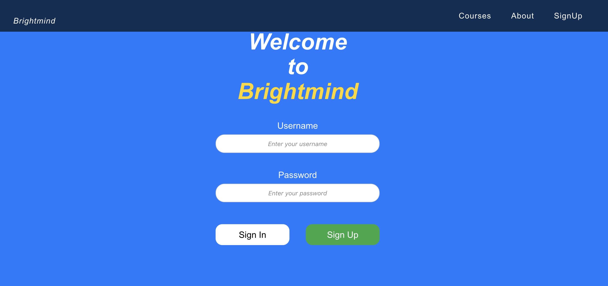
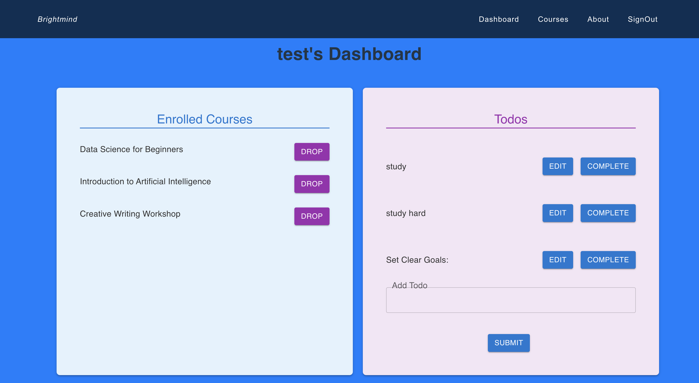
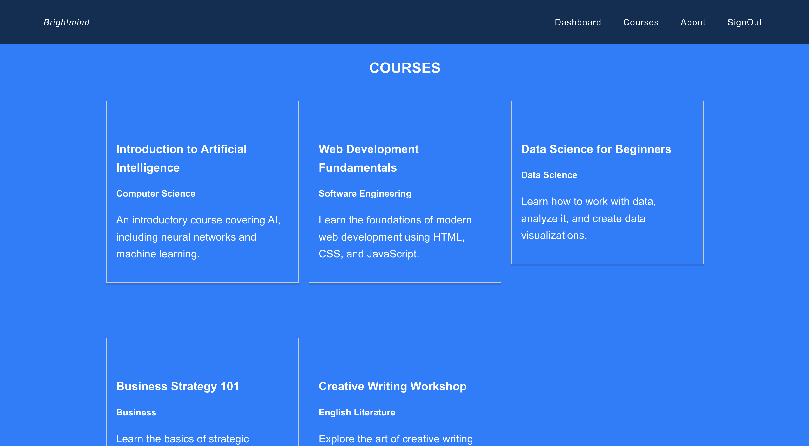

# BrightMind

BrightMind is a learning application designed to help users select courses they want to enroll in and learn. This app provides a simple interface for managing enrolled courses and tracking tasks with a to-do list. The goal of BrightMind is to create a seamless experience for learners to manage their education journey efficiently.

### Background

BrightMind was built to provide an organized way for learners to browse, enroll in, and manage their courses. With an integrated to-do list, users can also keep track of their learning tasks. The app was developed as a practical project to demonstrate functionality and simplicity in educational applications.

### Getting Started

• Deployed App: [BrightMind App](https://brightmind25.netlify.app/)
• Planning Materials: [Planning Materials](https://trello.com/b/yitonBgi/brightmind?utm_source=eval-email&utm_medium=email&utm_campaign=board-invite)
• Back-End Repository: [Back-End Repository](https://github.com/TGadaleta/BrightMind-Backend.git)

### Technologies Used

- JavaScript
- Mongoose for handling API interactions.
- React with functional components and hooks
- Material-UI for design and layout
- CRUD Functionality implemented for managing courses and tasks.

### Acknowledgments

BrightMind uses the following resources and credits the contributions that made this project possible:
• General Assembly project examples for inspiration and structure.
• Material-UI for components and styling.
• Material-UI Documentation for component implementation and design inspiration.
• MDN Web Docs for technical references and guidance.
• A heartfelt thank you to the instructors for their invaluable help and guidance throughout this project.

### Next Steps

Planned future enhancements include:
• Adding administrative functionality for managing courses and users.
• I want to view the lesson assessment, complete it, and get a grade.
• I want to see my current grades on the Dashboard..
